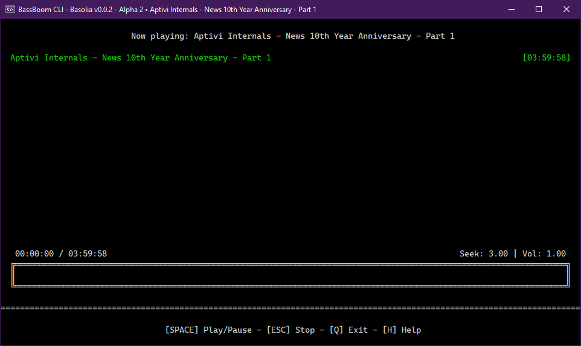

# Welcome!

<figure><figcaption></figcaption></figure>


32-bit platforms are no longer supported as of BassBoom v0.1.6. If you still want to target 32-bit platforms, you can use v0.1.5 or lower, but you'll miss out all the new groovy features and improvements.


BassBoom is a music player made with C# using the fast mpg123 library as the native backend that handles the music playback and song information, including the playback device information.

This library is a viable library aimed for cross-platform music playing because we've selected mpg123 as the MP3 backend library for its ease of use and for its fast music playback. This library is frictionless as it aims for stability and cross-platform compatibility.

In addition to your regular music files, BassBoom also supports online MPEG radio stations that you can use to play your own favorite radio stations, as long as they don't use AAC or any other codec that BassBoom doesn't support.


When using BassBoom, here are the notes to consider:

* This library only supports MPEG audio files. Unfortunately, this means no AAC and AAC+ support and no support for other non-MPEG audio files.
* If you found a radio station that only uses AAC, try to consult the radio station host for an MPEG version of the radio station stream, if available.


To learn more about mpg123, visit this site:



## This documentation

To get started, select a page on the left edge of the screen to get started.

mpg123 is licensed with [LGPL 2.1](https://mpg123.de/trunk/COPYING).
