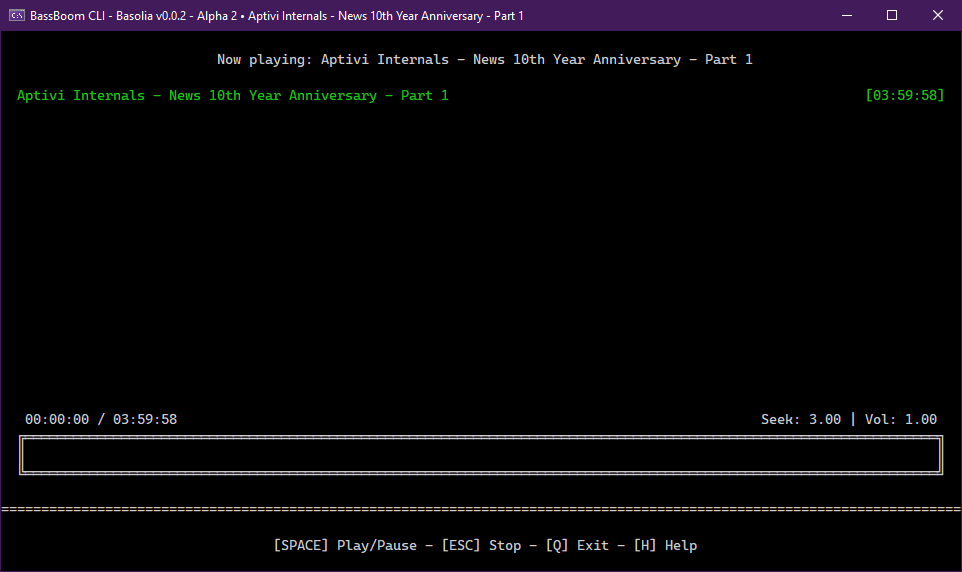

# BassBoom CLI

<figure><figcaption></figcaption></figure>

BassBoom provides you its CLI version that allows you to play any music using just your terminal emulator. You can use this version if you need no GUI and just want to play music using just the textual UI.


Since the TUI version uses Terminaux to render its elements, you need to have a terminal emulator which supports VT sequences out of the box.


## Usage

You can run this program by either double-clicking an executable file, which will prompt you for the full path to a music file, or by opening the command prompt to the BassBoom.Cli binaries directory and writing the command like this:

* For Windows, `BassBoom.Cli.exe path/to/music.mp3`
* For Linux, `dotnet BassBoom.Cli.dll path/to/music.mp3`

Additionally, you can use this program to run it as a radio station player using the `-r` switch without providing any argument.

* For Windows, `BassBoom.Cli.exe -r`
* For Linux, `dotnet BassBoom.Cli.dll -r`

Once done, BassBoom opens your music file to be ready for playing. Just play your music by pressing the spacebar.

## Controls

You can use the following keys to navigate through the entire music player or the radio player. However, there are keys that don't do anything in modes that don't define such keys. You can consult a list of keys available to you by pressing the `H` key.

### Idle mode (player)

When BassBoom.Cli is in idle mode (music not playing, music paused, etc.), you can use the following controls:

<table><thead><tr><th width="191">Control</th><th>Action</th></tr></thead><tbody><tr><td><code>UP</code></td><td>Raises the volume</td></tr><tr><td><code>DOWN</code></td><td>Lowers the volume</td></tr><tr><td><code>SPACE</code></td><td>Plays the music</td></tr><tr><td><code>B</code></td><td>Goes back to the previous song in the playlist and plays it</td></tr><tr><td><code>N</code></td><td>Goes to the next song in the playlist and plays it</td></tr><tr><td><code>H</code></td><td>Shows the help menu</td></tr><tr><td><code>I</code></td><td>Shows the song information, including the bit rate, artist, genre, etc.</td></tr><tr><td><code>A</code></td><td>Adds a single song to the playlist</td></tr><tr><td><code>SHIFT + A</code></td><td>Adds multiple songs from a playlist file</td></tr><tr><td><code>S</code></td><td>Adds songs from a music library directory to the playlist</td></tr><tr><td><code>R</code></td><td>Removes the current song</td></tr><tr><td><code>CTRL + R</code></td><td>Removes all the songs</td></tr><tr><td><code>E</code></td><td>Opens the interactive equalizer</td></tr><tr><td><code>Z</code></td><td>Shows BassBoom and platform information</td></tr><tr><td><code>SHIFT + Z</code></td><td>Shows BassBoom and platform information, with extra debug info</td></tr><tr><td><code>D</code></td><td>Shows all devices and drivers probed by MPG123</td></tr><tr><td><code>CTRL + D</code></td><td>Sets a device and driver</td></tr><tr><td><code>SHIFT + D</code></td><td>Resets a device and driver selection</td></tr><tr><td><code>C</code></td><td>Sets the repeat checkpoint (a.k.a. seek point)</td></tr><tr><td><code>SHIFT + C</code></td><td>Seeks to the repeat checkpoint (a.k.a. seek point)</td></tr><tr><td><code>V</code></td><td>Enables volume boost</td></tr><tr><td><code>F1</code></td><td>Save the current playlist to a playlist file (M3U or M3U8)</td></tr><tr><td><code>F2</code></td><td>Play test sound</td></tr><tr><td><code>Q</code></td><td>Exits the program</td></tr></tbody></table>

### Playing mode (player)

When BassBoom.Cli goes into this mode by playing any music, you can use these controls:

<table><thead><tr><th width="194">Control</th><th>Action</th></tr></thead><tbody><tr><td><code>UP</code></td><td>Raises the volume</td></tr><tr><td><code>DOWN</code></td><td>Lowers the volume</td></tr><tr><td><code>RIGHT</code></td><td>Seeks the music forward by the set seek rate</td></tr><tr><td><code>CTRL + RIGHT</code></td><td>Increases the seek rate by 50 milliseconds</td></tr><tr><td><code>LEFT</code></td><td>Seeks the music backward by the set seek rate</td></tr><tr><td><code>CTRL + LEFT</code></td><td>Decreases the seek rate by 50 milliseconds</td></tr><tr><td><code>B</code></td><td>Goes back to the previous song in the playlist and plays it</td></tr><tr><td><code>N</code></td><td>Goes to the next song in the playlist and plays it</td></tr><tr><td><code>SPACE</code></td><td>Pauses the music</td></tr><tr><td><code>R</code></td><td>Removes the currently playing song</td></tr><tr><td><code>CTRL + R</code></td><td>Removes all the songs</td></tr><tr><td><code>ESC</code></td><td>Stops the song</td></tr><tr><td><code>H</code></td><td>Shows the help screen</td></tr><tr><td><code>I</code></td><td>Shows the song info</td></tr><tr><td><code>E</code></td><td>Opens the interactive equalizer</td></tr><tr><td><code>D</code></td><td>Shows all devices and drivers probed by MPG123</td></tr><tr><td><code>CTRL + D</code></td><td>Sets a device and driver</td></tr><tr><td><code>SHIFT + D</code></td><td>Resets a device and driver selection</td></tr><tr><td><code>Z</code></td><td>Shows BassBoom and platform information</td></tr><tr><td><code>SHIFT + Z</code></td><td>Shows BassBoom and platform information, with extra debug info</td></tr><tr><td><code>S</code></td><td>Selectively seeks to the selected position</td></tr><tr><td><code>F</code></td><td>Seeks to the previous lyric</td></tr><tr><td><code>G</code></td><td>Seeks to the next lyric</td></tr><tr><td><code>J</code></td><td>Seeks to the current lyric</td></tr><tr><td><code>K</code></td><td>Seeks to the selected lyric</td></tr><tr><td><code>C</code></td><td>Sets the repeat checkpoint (a.k.a. seek point)</td></tr><tr><td><code>SHIFT + C</code></td><td>Seeks to the repeat checkpoint (a.k.a. seek point)</td></tr><tr><td><code>V</code></td><td>Enables volume boost</td></tr><tr><td><code>L</code></td><td>Disco mode!</td></tr><tr><td><code>F1</code></td><td>Save the current playlist to a playlist file (M3U or M3U8)</td></tr><tr><td><code>Q</code></td><td>Exits BassBoom.Cli</td></tr></tbody></table>

### Idle mode (radio)

When BassBoom.Cli is in idle mode (radio station not playing, radio station paused, etc.), you can use the following controls:

<table><thead><tr><th width="191">Control</th><th>Action</th></tr></thead><tbody><tr><td><code>UP</code></td><td>Raises the volume</td></tr><tr><td><code>DOWN</code></td><td>Lowers the volume</td></tr><tr><td><code>SPACE</code></td><td>Plays the radio station</td></tr><tr><td><code>B</code></td><td>Goes back to the previous radio station in the playlist and plays it</td></tr><tr><td><code>N</code></td><td>Goes to the next radio station in the playlist and plays it</td></tr><tr><td><code>H</code></td><td>Shows the help menu</td></tr><tr><td><code>I</code></td><td>Shows the radio station information, including the bit rate, artist, genre, etc.</td></tr><tr><td><code>CTRL + I</code></td><td>Shows the extended radio station information</td></tr><tr><td><code>A</code></td><td>Adds a single radio station to the playlist</td></tr><tr><td><code>SHIFT + A</code></td><td>Adds multiple songs from a playlist file</td></tr><tr><td><code>R</code></td><td>Removes the current radio station</td></tr><tr><td><code>CTRL + R</code></td><td>Removes all the radio stations</td></tr><tr><td><code>E</code></td><td>Opens the interactive equalizer</td></tr><tr><td><code>Z</code></td><td>Shows BassBoom and platform information</td></tr><tr><td><code>SHIFT + Z</code></td><td>Shows BassBoom and platform information, with extra debug info</td></tr><tr><td><code>D</code></td><td>Shows all devices and drivers probed by MPG123</td></tr><tr><td><code>CTRL + D</code></td><td>Sets a device and driver</td></tr><tr><td><code>SHIFT + D</code></td><td>Resets a device and driver selection</td></tr><tr><td><code>V</code></td><td>Enables volume boost</td></tr><tr><td><code>F1</code></td><td>Save the current playlist to a playlist file (M3U or M3U8)</td></tr><tr><td><code>Q</code></td><td>Exits the program</td></tr></tbody></table>

### Playing mode (radio)

When BassBoom.Cli goes into this mode by playing any music, you can use these controls:

<table><thead><tr><th width="190">Control</th><th>Action</th></tr></thead><tbody><tr><td><code>UP</code></td><td>Raises the volume</td></tr><tr><td><code>DOWN</code></td><td>Lowers the volume</td></tr><tr><td><code>RIGHT</code></td><td>Seeks the music forward by the set seek rate</td></tr><tr><td><code>CTRL + RIGHT</code></td><td>Increases the seek rate by 50 milliseconds</td></tr><tr><td><code>LEFT</code></td><td>Seeks the music backward by the set seek rate</td></tr><tr><td><code>CTRL + LEFT</code></td><td>Decreases the seek rate by 50 milliseconds</td></tr><tr><td><code>B</code></td><td>Goes back to the previous song in the playlist and plays it</td></tr><tr><td><code>N</code></td><td>Goes to the next song in the playlist and plays it</td></tr><tr><td><code>SPACE</code></td><td>Pauses the music</td></tr><tr><td><code>R</code></td><td>Removes the currently playing song</td></tr><tr><td><code>CTRL + R</code></td><td>Removes all the songs</td></tr><tr><td><code>ESC</code></td><td>Stops the song</td></tr><tr><td><code>H</code></td><td>Shows the help screen</td></tr><tr><td><code>I</code></td><td>Shows the song info</td></tr><tr><td><code>E</code></td><td>Opens the interactive equalizer</td></tr><tr><td><code>D</code></td><td>Shows all devices and drivers probed by MPG123</td></tr><tr><td><code>CTRL + D</code></td><td>Sets a device and driver</td></tr><tr><td><code>SHIFT + D</code></td><td>Resets a device and driver selection</td></tr><tr><td><code>Z</code></td><td>Shows BassBoom and platform information</td></tr><tr><td><code>SHIFT + Z</code></td><td>Shows BassBoom and platform information, with extra debug info</td></tr><tr><td><code>V</code></td><td>Enables volume boost</td></tr><tr><td><code>L</code></td><td>Disco mode!</td></tr><tr><td><code>F1</code></td><td>Save the current playlist to a playlist file (M3U or M3U8)</td></tr><tr><td><code>Q</code></td><td>Exits BassBoom.Cli</td></tr></tbody></table>

### Equalizer screen

You can also modify how your song or your radio station plays like in real-time using the interactive equalizer. You can use these controls:

| Control       | Action                                     |
| ------------- | ------------------------------------------ |
| `<-` / `->`   | Changes the current equalizer band's value |
| `UP` / `DOWN` | Selects the equalizer band                 |
| `R`           | Resets all values                          |
| `Q`           | Goes back to the player                    |
