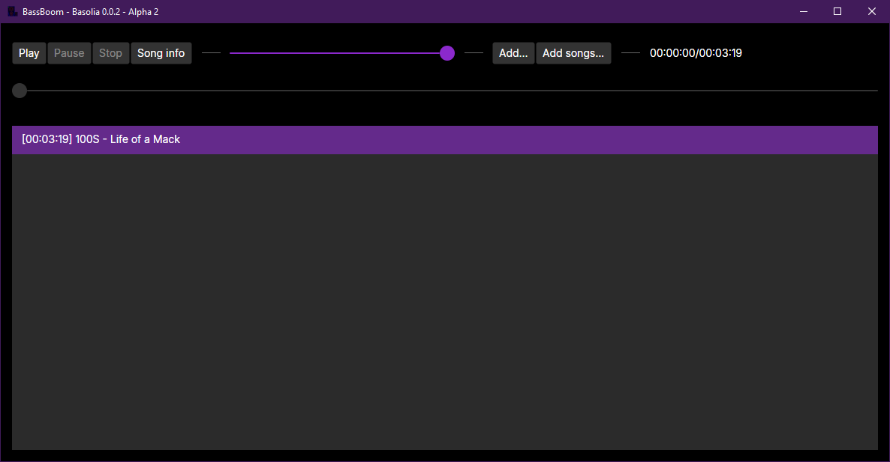

# BassBoom GUI

<figure><figcaption></figcaption></figure>


Currently, BassBoom 0.0.5 and above no longer provides the GUI version. We'll make a better GUI version soon in a future release.


Additionally, BassBoom provides a GUI version of the music player, which allows you to interactively play music with the graphical UI. It's easy to use; just use the buttons that are shown.

Currently, it opens with the playlist empty. You can use one of the two buttons to add songs to the playlist:

* Add: to add one or more songs to the playlist
* Add songs: to add songs from the music library folder to the playlist

Once done, you can finally select a song from the playlist and click on the Play button to play it.

You can pause the song by pressing the Pause button while the music is playing, and you can stop the song by pressing the Stop button.

You can also use the Song Info feature to get some information about your currently playing song.

The slider next to the buttons indicates the current volume, and the slider in the bottom indicates the current position, and you can seek through the entire song by moving the slider using your mouse.
